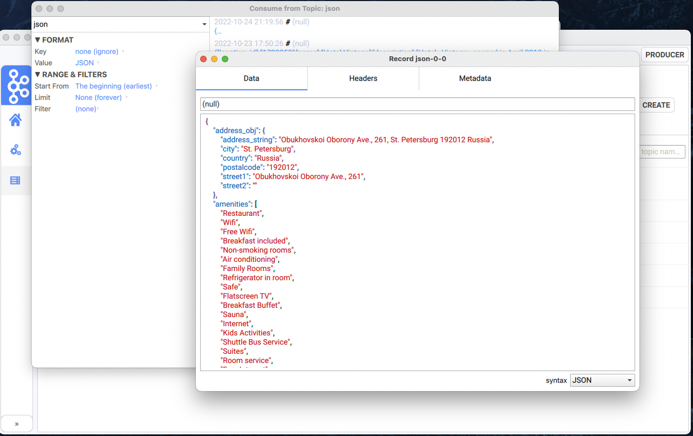

# Plumber simple desktop application for Apache Kafka

Plumber simple GUI desktop application for Apache Kafka based on [librdkafka](https://github.com/edenhill/librdkafka) and
[Qt](https://www.qt.io/) and written on C++. Docker/browser free just download and run.

## Features

* View all topics;
* View messages and add new messages;
* Add and drop topics;
* Show JSON in a pretty-printed format;
* Encode/decode protobuf;
* Experimental encode/decode avro.

## What happened to kafkaui?

**plumber is kafkaui**. The kafkaui project was renamed to adhere to the Apache Software Foundation's (ASF) trademark policies.
Apart from the name, nothing else was changed.

## Build from source

### Requirements

* Qt >= 6;
* librdkafka >= 1.7;
* spdlog;
* Boost;
* Snappy;
* protobuf >= 3.14.0.

#### GNU/Linux

    $ mkdir build
    $ cd build
    $ cmake -DCMAKE_BUILD_TYPE=Release ..
    $ make
    $ ./plumber

#### Windows

#### vcpkg and Visual Studio 2019

    .\vcpkg.exe install qt:x64-windows
    .\vcpkg.exe install librdkafka[*]:x64-windows --recurse
    .\vcpkg.exe install spdlog:x64-windows
    .\vcpkg.exe install boost:x64-windows
    .\vcpkg.exe install spdlog:x64-windows
    .\vcpkg.exe install protobuf:x64-windows
    .\vcpkg.exe install snappy:x64-windows
    cmake -B build -S . -DCMAKE_TOOLCHAIN_FILE=[path to vcpkg]/scripts/buildsystems/vcpkg.cmake
    cmake --build build
    [path to vcpkg]\installed\x64-windows\tools\Qt6\bin\windeployqt.debug.bat windeployqt.exe -qmldir=[path to vcpkg]\installed\x64-windows\Qt6\qml [project]\plumber\build\Debug
    cp -r [path to vcpkg]\installed\x64-windows\Qt6\qml\Qt\labs\platform [project]\plumber\build\Debugqml\Qt\labs\

### Mac OS X
    
    % brew install librdkafka
    % brew install spdlog
    % brew install qt@6
    % brew install boost
    % brew install protobuf
    % brew install snappy
    % cmake -B build -S . -DCMAKE_BUILD_TYPE=Release
    % cmake --build build --config Release

## Thanks 

